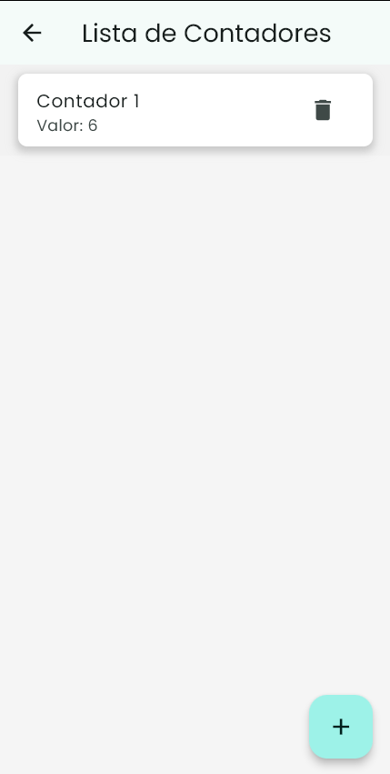
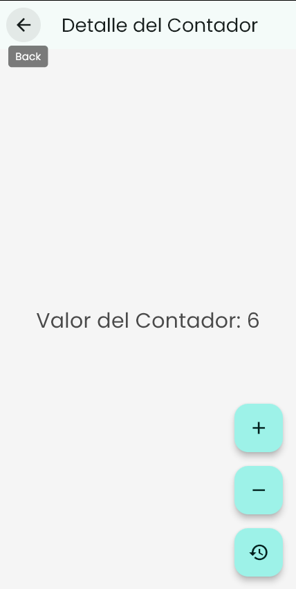

# 📱 Flutter Counter App  

A simple counter management app built with Flutter. This project demonstrates navigation, state management, and UI customization using themes and assets.  

## 🚀 Features  
- **Splash Screen**: A welcoming page introducing the app.  
- **Counter List**: Displays multiple counters that can be added or removed.  
- **Counter Details**: Allows users to increment, decrement, or reset a counter.  
- **Custom Fonts & Colors**: Uses the Poppins font and a predefined color scheme.  

## 🛠️ Installation  
1. Clone the repository:  
   ```sh
   git clone https://github.com/your-username/flutter-counter-app.git
   cd flutter-counter-app
   ```
2. Install dependencies:  
   ```sh
   flutter pub get
   ```
3. Run the app:  
   ```sh
   flutter run
   ```

## 📂 Project Structure  
```
flutter-counter-app/
│── lib/
│   │── main.dart
│   │── app.dart
│   ├── screens/
│   │   │── splash.dart
│   │   │── counter_list.dart
│   │   └── counter_detail.dart
│── assets/
│   ├── images/
│   │   │── onboarding-image.png
│   │   └── vector.png
│   ├── fonts/
│   │   │── Poppins-Bold.ttf
│   │   │── Poppins-Regular.ttf
│── pubspec.yaml
│── README.md
```

## 🏗️ Navigation Flow  
1. **Splash Screen** → Displays an intro message and a "Continue" button.  
2. **Counter List Screen** → Shows all counters, allows adding/removing counters.  
3. **Counter Detail Screen** → Allows modifying a specific counter.  

## 🖼️ Preview  
- **Splash Screen**  

      

- **Counter List**  

      

- **Counter Detail**  

      

## 📜 License  
This project is licensed under the MIT License.  